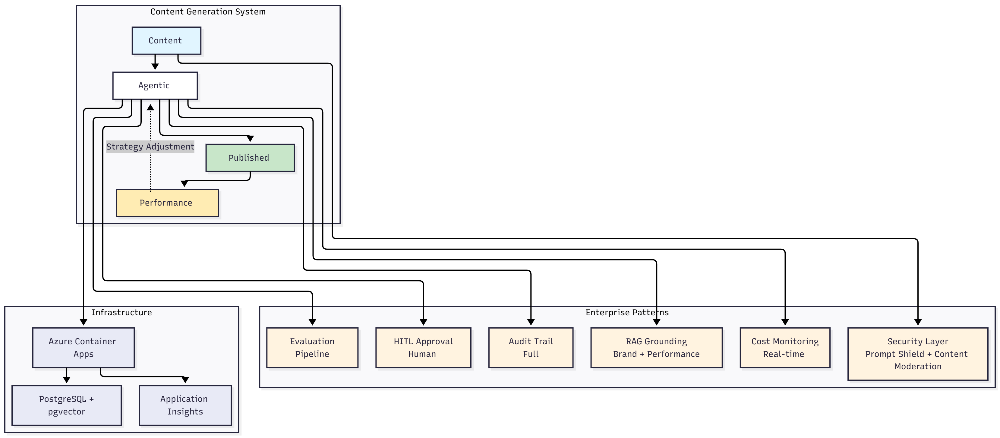

# Marketing Team — Data Directory Notes

This folder contains the marketing-team example code, notebooks, and sample data used for the RAG pipeline demos.

## Ignored persistent vector DB

The persistent Chroma vector database directory `data/chroma_db/` is intentionally ignored in git (see the repository `.gitignore`). This directory can contain large binary and index files that are generated at runtime and are not suitable for version control.

If you clone this repo and need to recreate the vector DB locally, follow one of these options:

1. Rebuild from the notebook (interactive)

   - Open `notebooks/week02_baseline_testing.ipynb` in Jupyter or VS Code and run the cells in order. The notebook will:
     - Load the brand documents from `data/past_posts/` and `configs/`.
     - Chunk content and create embeddings using your configured embedding provider.
     - Populate `data/chroma_db/` with the resulting collection (collection name: `marketing_content`).

2. Rebuild headlessly (script)

   - If you prefer a non-interactive approach, you can run the relevant initialization script or a small Python runner that imports the same `DocumentLoader`, `RAGHelper`, and `VectorStore` classes used in the notebook. Example pattern:

   ```powershell
   # Activate your virtual env first
   python -m venv .venv; .\.venv\Scripts\Activate.ps1
   python -c "from src.rag.document_loader import DocumentLoader; from src.rag.rag_helper import RAGHelper; from src.rag.vector_store import VectorStore; ..."
   ```

## Notes

- Make sure to populate a `.env` file with your API keys before running the notebook or scripts.
- The notebook assumes embedding models are available via your selected LLM provider (see `notebooks/week02_baseline_testing.ipynb` environment notes).
# LevelUp360 Agentic Marketing System

**Production-grade agentic AI system for dual-brand content generation, built through Evaluation-Driven Development.**

**Status**: Week 1 Complete — Foundation & Evaluation Framework  
**Methodology**: Data-driven architecture decisions through systematic testing  
**Deployment**: Local development (Weeks 1-4) → Azure production (Weeks 5+)

---

## What I'm Building

A production agentic marketing system that generates LinkedIn content for two real brands (AI consulting + cosmetics), designed to **enterprise production standards**:

**Core Capabilities**:
- **Quality-First**: >7/10 content quality (human rubric), >2% engagement target (stretch >3%)
- **Cost-Efficient**: <€2 per post operational cost
- **Production-Grade**: HITL approvals, observability, cost monitoring, evaluation pipelines
- **Enterprise Security**: Azure Content Safety (Prompt Shield, Content Moderation, Groundedness Detection)
- **Performance Tracking**: Automated Facebook + LinkedIn analytics with insights embedded as retrieval context for adaptive decision-making
- **Data-Driven**: All architectural decisions validated through systematic testing with real content

**Technical Approach**:
- **Orchestration**: TBD based on Week 4 testing (LangGraph vs CrewAI vs Hybrid)
- **Pattern**: TBD based on Week 3 testing (Single-pass vs Reflection vs Evaluator-Optimizer)
- **Model Selection**: TBD based on Week 3 testing (GPT-4o-mini baseline vs hybrid configurations vs best-in-class)
- **Grounding**: RAG with PostgreSQL + pgvector for brand knowledge, past content, guidelines; text-embedding-3-small (1536D)
- **Search**: Tavily AI-first search API for LLM-optimized evidence retrieval
- **Security**: Azure Content Safety (Prompt Shield for jailbreak detection, Content Moderation, Groundedness Detection)
- **Analytics**: Automated Facebook + LinkedIn post performance tracking with agentic learning
- **Multi-Brand Isolation**: Separate PostgreSQL tables per brand (zero cross-contamination)
- **Deployment**: Azure Container Apps (Staging + Production) with Application Insights monitoring

**Why This Approach**:
- **Evaluation-Driven Development**: Define success metrics BEFORE building, test alternatives with data
- **Transparent Methodology**: Share testing process, decision rationale, outcomes weekly
- **Production Patterns**: Implements evaluation pipelines, logging, cost tracking, drift detection from Day 1
- **Transferable**: Same patterns map to enterprise use cases (finance, healthcare, compliance)

---

## Why This Approach: Patterns Over Tools

**The use case is marketing (what I actually need). The patterns are enterprise.**

This system demonstrates enterprise production-grade AI patterns that transfer directly to regulated industries:

| Pattern | Marketing Implementation | Enterprise Translation |
|---------|-------------------------|------------------------|
| **HITL Approvals** | Human reviews content before publishing | Compliance officer approves financial advice, legal reviews contracts |
| **RAG Grounding** | Brand guidelines + past posts context | Policy documents + regulatory requirements grounding |
| **Security Layers** | Prompt Shield + Content Moderation + Groundedness Detection | Jailbreak prevention, harmful content filtering, hallucination detection for regulated outputs |
| **Performance Tracking** | Automated Facebook/LinkedIn analytics; insights embedded as RAG context for strategy adjustment | Transaction outcome tracking (conversion rates, fraud signals); insights embedded as retrieval context for adaptive decision-making |
| **Evaluation Pipelines** | Quality scoring (clarity, brand voice, accuracy) | Risk scoring (compliance, bias detection, hallucination checks) |
| **Cost Monitoring** | Per-post cost tracking (<€2 target) | Per-transaction budget enforcement |
| **Observability** | Full decision audit trail (what was generated, why, by whom) | Regulatory audit trail (explainability, version control) |
| **Drift Detection** | Content quality degradation monitoring | Model performance degradation in production |
| **Multi-Brand Isolation** | Separate PostgreSQL tables per brand (zero cross-contamination) | Separate tenant data stores (HIPAA, GDPR compliance for multi-client deployments) |

**Production Bias**: Everything runs with logs, budgets, and evidence. Local-first for cost efficiency; Azure parity for enterprise deployment.

**Critical Distinction: RAG Augmentation vs Model Retraining**

All "learning" and "adaptation" in this system occurs via **retrieval-augmented context**, not model retraining:
- **What we do**: Embed performance insights, user feedback, and domain knowledge as vectors; agents retrieve relevant context during generation and adjust prompts/strategy accordingly
- **What we don't do**: Fine-tune models, update model weights, or retrain on new data
- **Why this matters for enterprises**: RAG augmentation is instant (no training time), explainable (audit trail shows which insights influenced decisions), and zero ML infrastructure cost. For regulated industries, explainability and auditability trump model retraining.
- **When retraining makes sense**: High-volume, domain-specific use cases (e.g., legal contract generation with 100K+ examples). For Q1 marketing use case, RAG augmentation delivers better ROI.

---

## Problem Statement

**Business Challenge**: Build an AI marketing system that achieves measurable outcomes while avoiding the 95% GenAI pilot failure rate (MIT 2025).

**Specific Requirements**:
- Generate LinkedIn content for two distinct brands maintaining brand voice
- Achieve engagement >2% in month 2 and cost <€2 per post
- Operate with production requirements: evaluations, logging/tracing, cost monitoring, human approval
- Demonstrate transferable patterns for regulated industries

**Root Cause Being Addressed**: 73% of AI project failures trace to poor problem definition and insufficient validation (MIT 2025). We address this through Evaluation-Driven Development—testing alternatives with real data before architectural commitments.

---

## Architecture Philosophy

### **High Level Architecture Overview**



The system implements enterprise patterns (security, HITL governance, RAG grounding, observability) across three environments for rigorous testing and production deployment.

### **Three-Environment Strategy**

**Local Development (Weeks 1-4)**:
- **Purpose**: Rapid experimentation, pattern/framework/model testing
- **LLM**: OpenRouter API (GPT-4o-mini, GPT-4o, Claude 3.5 Haiku) for flexible model testing
- **Vector Store**: Chroma (local file) with text-embedding-3-small (1536D)
- **Search**: Tavily web search integration for evidence-based content
- **Testing**: Jupyter notebooks with systematic evaluation (10-20 pieces per condition)
- **Cost**: ~€40-60 for entire testing phase (includes model selection testing)

**Staging Deployment (Week 5+)**:
- **Purpose**: Production-parity validation before release
- **LLM**: Azure OpenAI (GPT-4o-mini + optional GPT-4o or Claude 3.5 Haiku based on Week 3 model selection)
- **Vector Store**: PostgreSQL + pgvector (1536D, persistent, zero additional cost)
- **Platform**: Azure Container Apps (stateless, scalable)
- **Monitoring**: Application Insights (full observability)
- **Testing**: End-to-end validation, HITL approval workflow, cost/latency verification
- **Cost**: ~€25-35/month (shared infra with Production)

**Production Deployment (Week 5+)**:
- **Purpose**: Live content generation with strict governance
- **Stack**: Same as Staging (consistency guaranteed)
- **Differences**: Separate resources, stricter RBAC, production secrets, higher availability targets
- **Monitoring**: Application Insights + alerting on quality drift, cost overruns, failures
- **Cost**: ~€25-35/month

### **Key Design Decisions**

**Decision**: Test model configurations systematically before committing  
**Rationale**: Aligns with Evaluation-Driven Development principles — no assumptions about "best" model without data. Week 3 will test 4 configurations (GPT-4o-mini baseline, hybrid reasoning with GPT-4o, best-in-class with Claude 3.5 Haiku, GPT-4o ceiling) on 15 pieces each. Decision criteria locked: quality ≥7/10, cost <€2/post, latency <60s, consistency (stdev <1.5). Choose based on quality per euro; default to simplest if tied.

**Decision**: text-embedding-3-small for embeddings (1536D)  
**Rationale**: It provides better quality and cost efficiency than text-embedding-ada-002; This is the only model I am choosing up-front because immediate adoption avoids migration later. Compatible with Chroma (local) and PostgreSQL+pgvector (production).

**Decision**: PostgreSQL + pgvector for production embeddings  
**Rationale**: Zero additional cost (already paying for PostgreSQL), persistent by design, no cold start, one database for everything (logs, content, state, embeddings), sufficient performance (10-50ms query time is <1% of total pipeline time).

**Decision**: Defer orchestration pattern and framework choice to testing  
**Rationale**: AI Engineering principle: test alternatives with YOUR data before committing. Week 3 tests patterns (single-pass vs reflection vs evaluator-optimizer); Week 4 tests frameworks (LangGraph vs CrewAI vs Hybrid). Decisions based on quality, cost, latency, and developer experience—not assumptions.

---

## Model Selection Strategy (Week 3)

**Challenge**: Choosing models based on assumptions (e.g., "GPT-4o-mini is good enough") violates Evaluation-Driven Development principles.

**Solution**: Systematic testing of 4 model configurations in Week 3 (Days 6-7) using the winning orchestration pattern.

**Configurations to Test**:
1. **Config A - GPT-4o-mini Baseline**: Single model everywhere (simplest, lowest cost)
2. **Config B - Hybrid Reasoning**: GPT-4o-mini for research/generation + GPT-4o for evaluation/optimization (balance cost and quality)
3. **Config C - Best-in-Class**: GPT-4o-mini (research) + Claude 3.5 Haiku (generation/optimization) + GPT-4o (evaluation) (maximize quality, highest complexity)
4. **Config D - GPT-4o Ceiling**: GPT-4o everywhere (quality benchmark; likely exceeds cost target)

**Decision Criteria** (locked before testing):
- **Primary** (must pass): Quality ≥7/10, Cost <€2/post, Latency p95 <60s, Consistency (stdev <1.5)
- **Secondary** (tie-breakers): Quality per euro, Brand voice fidelity ≥7.5, Error rate <5%, Developer experience
- **Rules**: If multiple pass, choose lowest cost. If tied on cost, choose highest quality. If tied on both, choose simplest (fewest models).

**Sample Size**: 15 pieces per configuration (60 total) for 80% confidence in relative performance.

**Why This Matters**: Multi-model configurations (B, C) add integration complexity and debugging challenges. Single-model (A) is simplest but may sacrifice quality. Testing with real data determines the optimal trade-off before committing to framework implementation in Week 4.

**Expected Outcome**: Winning model configuration documented with quality/cost/latency data; used in all Week 4 framework testing for consistency.

---

## Evaluation Framework

### **Four Evaluation Pillars** (Chip Huyen, AI Engineering)

1. **Domain-Specific Capability**: Does it understand AI consulting + cosmetics marketing?
2. **Generation Quality**: Coherence, relevance, factuality, fluency, engagement potential
3. **Instruction-Following**: Follows format rules, brand voice, required elements
4. **Cost & Latency**: <€2/post, <60 seconds generation time

### **Multi-Method Evaluation**

- **Human Scoring** (Weeks 1-4): Manual rubric evaluation (gold standard)
- **Multi-Criteria Rubric**: 1-10 scale across 5 dimensions (clarity, brand voice, CTA, accuracy, engagement)
- **AI-as-a-Judge** (Weeks 5+): Automated quality evaluation (scaled, calibrated against human scores)
- **Real User Feedback** (Weeks 6+): Engagement metrics from published content (business validation)

**Sample Size**: 10 examples per test condition for directional confidence; 15+ for high-confidence decisions (OpenAI research). Solo builder constraint: I will prioritize AI-judge scaling with spot human validation.

---

## 12-Week Roadmap

### **Month 1: Foundation + Testing (Weeks 1-4)**
- **Week 1**: Evaluation framework, infrastructure setup ✅ **COMPLETE**
- **Week 2**: Baseline testing (prompts + RAG + search)
- **Week 3**: Orchestration pattern testing (single-pass vs reflection vs evaluator-optimizer) + Model selection testing (4 configurations)
- **Week 4**: Framework testing (LangGraph vs CrewAI vs Hybrid) using winning pattern and model config from Week 3, and finalize retrieval architecture (semantic-only vs hybrid search).

**Key Principle**: No architectural commitments until data validates choices. Week 3 extended by 2 days for model selection testing to ensure optimal model choice before framework implementation.

### **Month 2: Build + Validate (Weeks 5-8)**
- **Week 5**: Production implementation with winning architecture + HITL
- **Week 6**: Observability + automated evaluation pipeline
- **Week 7**: Case Study 1 (LevelUp360 AI consulting brand)
- **Week 8**: Case Study 2 (Cosmetics brand—transferability test)

**Key Principle**: Continuous evaluation, not "set and forget"

### **Month 3: Scale + Productize (Weeks 9-12)**
- **Week 9**: Performance optimization (cost reduction, latency improvement)
- **Weeks 10 & 11**: Documentation + replication template
- **Weeks 12**: Retrospective + Q2 planning

**Key Principle**: Transform learnings into productized consulting service

---

## What I'll Share vs What Stays Private

### **Public (This Repository)**
- Weekly reports documenting design decisions, testing results, outcomes
- Jupyter notebooks with testing methodology and evaluation results
- Architecture diagrams and technical documentation
- Sanitized brand configs and evaluation rubrics
- Public tool adapters (web search, RAG interfaces)
- Cost and performance metrics from local and Azure environments
- Case studies with real engagement data

### **Private (Not Included)**
- Proprietary prompt engineering "personalities"
- Detailed brand content and competitive intelligence
- Production secrets, API keys, Azure resource IDs
- Client-specific customizations and governance rules
- Advanced evaluation logic and threshold tuning
- Full Azure infrastructure as code (Terraform)

**Why the Split**: Public content demonstrates methodology and capability (consulting value). Private content is implementation-specific IP.
---

## Repository Structure

~~~text
/
├── README.md                          # This file (high-level overview)
├── reports/
│   ├── week_01_foundation.md          # Week 1: Design decisions, evaluation framework
│   ├── week_02_baseline_testing.md    # Week 2: Prompt + RAG testing
│   └── ...                            # Weekly reports continue
├── notebooks/
│   ├── week_02_prompt_testing.ipynb        # Baseline prompt experiments
│   ├── week_03_pattern_comparison.ipynb    # Orchestration pattern testing
│   ├── week_03_model_selection.ipynb       # Model configuration testing
│   ├── week_04_framework_comparison.ipynb  # LangGraph vs CrewAI vs Hybrid
│   └── ...
├── architecture/
│   ├── evaluation_framework.md        # Detailed evaluation methodology
│   ├── local_environment.md           # Local development setup
│   ├── production_architecture.md     # Azure production deployment
│   └── diagrams/                      # Architecture diagrams
├── configs/
│   ├── evaluation_rubric.yaml         # Scoring rubric definition
│   ├── brand_levelup360.yaml          # LevelUp360 brand config (sanitized)
│   └── brand_cosmetics.yaml           # Cosmetics brand config (sanitized)
├── requirements.txt
├── pyproject.toml
└── LICENSE
~~~

---

## Quickstart

### Prerequisites
- Python 3.11+
- Azure OpenAI API access
- PostgreSQL 14+ (for production deployment)

### Local Development (Weeks 1–4)

1) Create environment and install dependencies

Windows (PowerShell)
~~~powershell
py -3.11 -m venv .venv
.\.venv\Scripts\Activate.ps1
pip install -U pip
pip install -r requirements.txt
~~~

macOS/Linux
~~~bash
python3.11 -m venv .venv
source .venv/bin/activate
python -m pip install -U pip
pip install -r requirements.txt
~~~

2) Configure environment variables

Create a `.env` file:
~~~env
# OpenRouter
OPENROUTER_API_KEY = your-key
OPENROUTER_BASE_URL = https://openrouter.ai/api/v1
TAVILY_API_KEY = your-key
~~~

3) Run notebooks

---

## Success Metrics

### Technical
- Content quality (human rubric): ≥ 7/10 average
- Technical generation cost: < €2 per post
- Generation latency: < 60 seconds
- System uptime (production): > 95%

### Business
- Content published: 50+ pieces (both brands)
- Engagement rate: >5% target (accept 3-5% in Month 2 as system and audience warm up)
- Page views: +30%
- Gig inquiries: 1–2 (assessments/pilots)
- Network growth: +50 relevant connections

### Learning
- Skills assessment: Avg 9/10 across competencies
- Testing notebooks: 6+ published (transparent methodology)
- Case studies: 2 complete with data
- Principles adherence: 100% data‑driven decisions

---

## Key Statistics & Research

- Many GenAI pilots fail to reach measurable ROI (MIT‑affiliated report; Fortune/Forbes coverage)
- ~85% of AI projects never reach production (widely cited Gartner estimate)
- Numerous failures trace to poor problem definition and validation
- LinkedIn organic engagement ≈ 2% (industry benchmarks)
- Outsourced content ≈ €200+ per post (market rates)

Full citations and verification: see CITATIONS.md

---

## Methodology: Evaluation‑Driven Development

Based on Chip Huyen’s AI Engineering principles.

**Core Tenet**  
“Define what ‘good’ looks like BEFORE you build, and use those definitions to guide model selection, design, deployment, and iteration.”

**Our Application**
- Week 1: Define evaluation criteria (four pillars, rubric, metrics)
- Weeks 2–4: Test alternatives systematically (prompts/RAG, patterns, frameworks)
- Decision framework: Choose based on data (quality scores, cost, latency)
- Weeks 5+: Build with confidence; monitor continuously
- Publication: Share transparent testing process and outcomes

**Current Status**

| Week | Status | Key Deliverables | Report |
|----------|-------------|------------------|--------|
| **Week 1** | ✅ Complete | Evaluation framework, three-environment strategy, decision criteria [Week 1 Report](/marketing-team/reports/WEEK1.md) |
| **Week 2** | ✅ Complete | RAG system implementation (Chroma, 40-post corpus), brand guidelines refinement (system message enforcement), search integration (Tavily + LLM query optimization), corpus composition testing (25% → 100% retrieval success), first production post published | [Week 2 Report](/marketing-team/reports/WEEK2.md) |
| **Week 3** | ✅ Complete | Orchestration pattern testing (60 pieces: single-pass, reflection, eval-optimizer), evaluation system calibration (temperature uniformity, violation detection), cross-brand validation (LevelUp360 + Ossie Naturals), model selection (Claude Sonnet 4 + reference post), production decision: eval-optimizer pattern (8.69/10 LevelUp360, 8.42/10 Ossie) | [Week 3 Report](/marketing-team/reports/WEEK3.md) |
| **Week 4** | ✅ Complete | LangGraph multi-agent system implementation, architecture correction (deterministic to agentic), 100% routing accuracy (22/22 scenarios), framework-agnostic architecture (domain logic in classes), config-driven system (4.3x ROI), production package structure, dual-brand support validated | [Week 4 Report](/marketing-team/reports/WEEK4.md) |

---

## About
This repository documents a 12‑week journey building a production agentic marketing system through Evaluation‑Driven Development.

### Target Audience
- **AI Engineers/Architects**: production patterns (evaluation, observability, cost control)
- **Security Architects**: patterns translate directly to compliance-sensitive workload
- **Technical Leaders**: data‑driven AI architecture methodology
- **Consultants**: seeing transferable patterns for enterprise AI delivery

### Value Proposition
The system serves two real brands and generates actual published content. The patterns demonstrated (approvals, RAG grounding, observability, cost guards, secure deployment) translate directly to compliance-sensitive workloads in finance, healthcare, insurance, and legal industries.

### Core Message
Patterns, not tools. If I trust these patterns with my own brand, you can trust them for your regulated workloads.

## License
MIT — see LICENSE

## Contact
Manuel Tomas Estarlich  
LinkedIn: https://www.linkedin.com/in/manuel-tomas-estarlich/  
