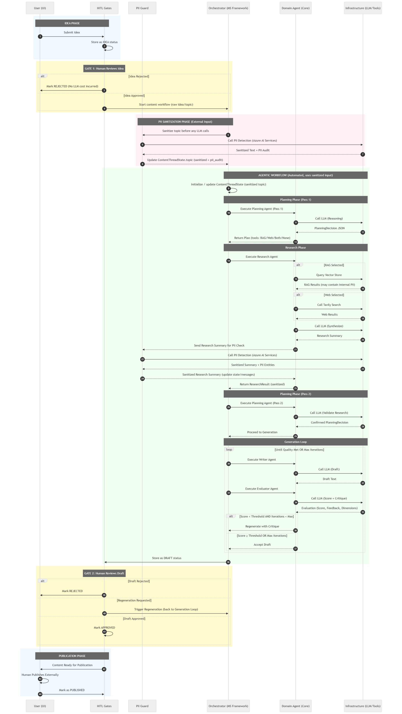
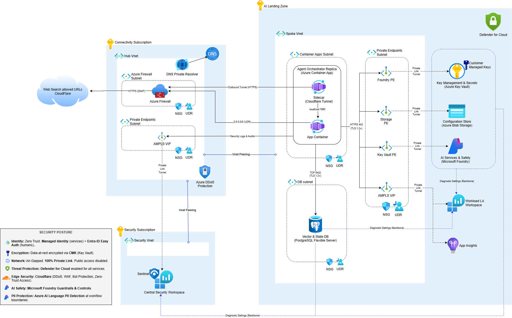
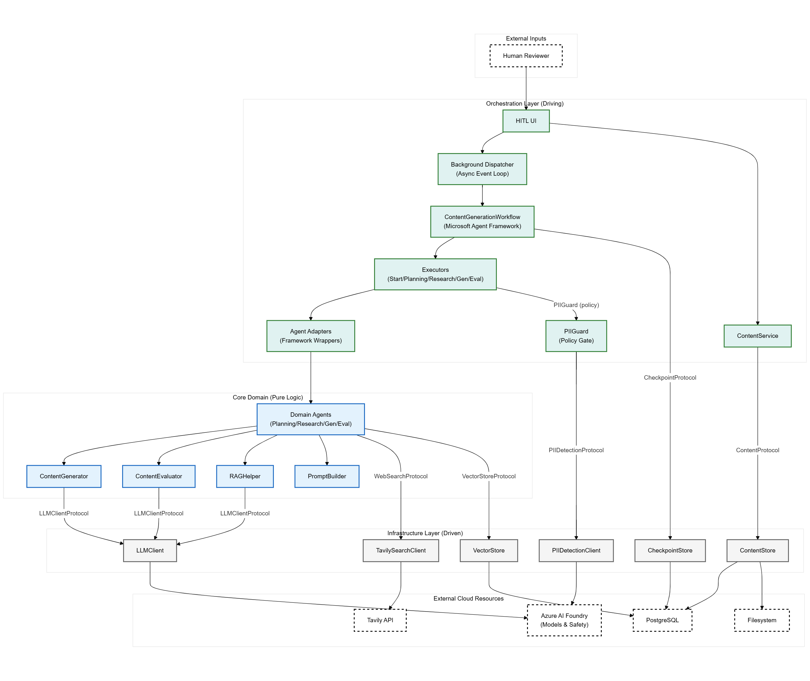

# LevelUp360 Agentic Marketing System

**Bank-grade, GDPR & EU AI Act Article 14–aligned agentic content system — built solo in 12 weeks with production security, two human-in-the-loop gates, PII sanitisation, and full audit trails. Reference implementation public (Weeks 1–6); production architecture documented (Weeks 7–12, code private).**

**Context**: Expanding my enterprise AI delivery capabilities (20+years in the industry, 10+ years building production systems in regulated environments) into agentic orchestration patterns. Started as a low-risk marketing sandbox; ended as an insurable, bank-grade agentic system with HITL governance, PII guardrails, and full decision traceability.

**Status**: 12-Week Journey Complete ✅ — EU AI Act Article 14 compliant (seven months early). Production system running: two HITL gates, PII sanitisation at workflow boundaries, workflow traces, identity without PII, ~€29/week operational cost at current volume.  
**Methodology**: Evaluation-Driven Development (data-driven architecture decisions—enterprise standard)  
**Deployment Path**: Local reference implementation complete → Azure production (Weeks 7+ private)

---

## Architecture Overview


*Two human gates. No auto-publish. Every approval traced to authenticated identity.*


*100% Private Link. Cloudflare edge. Managed Identity. Key Vault.*


*Framework-agnostic core. Protocol-driven boundaries. Swap infrastructure without touching business logic.*

---


## What I Built

An **agentic marketing system** serving two real brands (my AI consulting practice LevelUp360 + partner's cosmetics brand), built with **the same production-grade patterns I've used in enterprise delivery for 10+ years**—now applied to agentic orchestration frameworks (LangGraph as baseline, Microsoft Agent Framework for production; CrewAI evaluated and rejected Week 5).

### Why Marketing as the Use Case?

Marketing started as a **low-risk sandbox** to master agentic frameworks while applying enterprise rigor I already know from regulated delivery (evaluation pipelines, cost budgets, HITL approvals, security layers, observability, drift detection).

By Week 12, the same system operates with **bank-grade controls**: two explicit HITL gates, PII sanitisation at workflow boundaries, Entra GUID–based identity without PII, Cloudflare perimeter, and workflow traces aligned with EU AI Act Article 14 human-oversight requirements.

### What's Familiar (Enterprise Patterns I've Delivered Before)

These patterns are **proven in my production work** (finance, compliance, regulated ML systems). I'm applying them here to validate they work with agentic orchestration:

- ✅ **Evaluation-Driven Development**: Define metrics before building, test systematically, choose based on data (not opinions)
- ✅ **Cost Controls**: Runtime budget enforcement, per-operation tracking, and explicit cost modelling (see Cost Transparency; all-in cost ≈€0.30–0.55/post depending on volume, vs <€2 target)
- ✅ **Security Layers**: Azure Content Safety integrated from Day 1 (Prompt Shield, content moderation, groundedness detection)
- ✅ **HITL Approval Workflows**: Human-in-the-loop governance before any output goes live
- ✅ **Full Observability**: Application Insights monitoring, decision audit trails, lineage tracking
- ✅ **Drift Detection**: Quality degradation monitoring over time (automated alerts on metric decay)
- ✅ **Multi-Tenant Isolation**: Separate PostgreSQL tables per brand (zero cross-contamination—GDPR/compliance pattern)

### What's New (Agentic AI Tooling I'm Systematically Testing)

This is the **skill expansion** focus—mastering agentic orchestration frameworks through hands-on testing:

- 🔄 **LangGraph supervisor patterns**: 100% routing accuracy achieved Week 4 (22/22 scenarios, 110/110 runs)
- 🔄 **CrewAI hierarchical orchestration**: Week 5 spike and early rejection (LangChain dependency, complexity); informed pivot to Microsoft Agent Framework for production
- 🔄 **Multi-agent coordination strategies**: Eval-optimizer pattern winner Week 3 (8.56/10 avg quality vs 8.20 reflection, 7.64 single-pass)
- 🔄 **Framework-agnostic architecture**: Same business logic, swappable orchestration—enables objective comparison without refactoring

### Technical Stack (v1.0-reference)

- **Orchestration**: Microsoft Agent Framework (primary, Week 6) with custom typed state model; LangGraph (alternative implementation for comparison)
- **Pattern**: Eval-optimizer (8.56/10 avg quality, Week 3 winner)
- **LLM Provider**: Provider-agnostic configuration with dual-model support (OpenRouter for dev, Azure AI Foundry for production); see WEEK9+.md for architecture details
- **Grounding**: RAG with ChromaDB (local/reference) for brand knowledge; embedding model configurable per environment
- **Search**: Tavily AI-first search API for LLM-optimized evidence retrieval
- **UI (local reference)**: Gradio 5.33.1 (simple functional interface for brand config, document ingestion, content generation)
- **Production Platform (private code)**: Azure Container Apps, PostgreSQL + pgvector, Azure Content Safety, OpenTelemetry + Application Insights, Cloudflare security perimeter, Azure Container Apps Easy Auth (Entra ID)

### Core Capabilities (Validated Metrics)

- **Quality-First**: ≥9/10 content quality via human rubric evaluation ✅ **Achieved**: ≈9/10 after brand YAML refinements (≥8.56/10 from Week 3 baseline)
- **Cost-Efficient**: <€2 per post operational cost ✅ **Achieved**: ≈€0.30–0.55/post all-in depending on volume (API-only cost ≈€0.04/post)
- **Performance**: <60s generation latency ✅ **Achieved**: <20s in production (≈<40s in earlier Week 4 tests)
- **Routing Accuracy**: 100% correct tool selection ✅ **Achieved**: 22/22 scenarios 
- **Production-Grade**: HITL approvals, observability, cost monitoring, evaluation pipelines (enterprise standard)

---

## Repository Structure: Week-by-Week Branches

**Each week has its own Git branch** with complete code, notebooks, and setup instructions specific to that week's focus:

### Week Branches

| Branch | Focus | Status | Key Deliverables |
|--------|-------|--------|------------------|
| `week-01` | Evaluation framework, infrastructure setup | ✅ Complete | Three-environment strategy, decision criteria, evaluation rubrics |
| `week-02` | RAG system + baseline testing | ✅ Complete | Chroma vector store, 40-post corpus, Tavily search, brand guidelines refinement |
| `week-03` | Orchestration patterns + model selection | ✅ Complete | Single-pass/reflection/eval-optimizer testing, Claude Sonnet 4 selection, cross-brand validation |
| `week-04` | LangGraph multi-agent system | ✅ Complete | Supervisor pattern, 100% routing accuracy, framework-agnostic architecture, config-driven system |
| `week-05` | Framework comparison + Microsoft Agent Framework adoption | ✅ Complete | CrewAI evaluation (rejected: LangChain dependency), Microsoft Agent Framework validation (custom LLMClient + state passing), Design decision #21: Microsoft Agent Framework for production |
| `week-06` | Microsoft Agent Framework + Gradio UI | ✅ Complete | Custom typed state model, executor/agent separation, simple functional UI, v1.0-reference release |
| `week-07` | Azure Infrastructure + CI/CD | ✅ Complete 🔒 Private | Full Terraform infrastructure (14 modules), two-project architecture, GitHub Actions CI/CD, unified app codebase, managed identity auth |
| `week-08+` | Production hardening (private) | 🔒 Private | End-to-end Azure testing, HITL workflows, advanced features, governance automation, observability (insights shared, code private) |

### How to Use Week Branches

Each week branch is **self-contained** with:
- Complete working code for that week's implementation
- Jupyter notebooks with setup instructions and testing methodology
- Week-specific `requirements.txt` (dependencies may evolve week-to-week)
- Configuration files and sample data
- Detailed README with environment setup for that week

**To work with a specific week**:

```bash
# Clone the repository
git clone <repository-url>
cd agentic-ai-marketing-team

# Checkout the week you want to explore
git checkout week-04  # For Week 4 LangGraph implementation

# Follow that week's setup instructions
# (each week's notebooks contain setup steps)
```

**Why separate branches?**
- Each week builds on previous learnings but may refactor significantly
- Week 3 tested patterns → Week 4 implemented winner (eval-optimizer)
- Week 4 tested LangGraph → Week 5 tests CrewAI → one will be chosen for production
- Week 5 tested CrewAI → Early rejection + Microsoft Agent Framework evaluation → Microsoft Agent Framework chosen for production
- Branches preserve working code at each stage (no breaking changes when refactoring)

---

## Weekly Reports (Design Decisions + Results)

Detailed week reports are published in this repository documenting:
- Design decisions (architecture, patterns, tools)
- Testing methodology (scenarios, criteria, sample sizes)
- Results (quality scores, cost, latency, insights)
- Lessons learned (what worked, what didn't, enterprise transferability)


| Week | Report | Key Outcomes |
|------|--------|--------|
| **Week 1** | [WEEK1.md](reports/WEEK1.md) | Evaluation framework, three-environment strategy, decision criteria |
| **Week 2** | [WEEK2.md](reports/WEEK2.md) | RAG system (Chroma, 40-post corpus), Tavily search, corpus testing (25% → 100% retrieval success) |
| **Week 3** | [WEEK3.md](reports/WEEK3.md) | Orchestration pattern testing (60 pieces), eval-optimizer winner (8.56/10), model selection (Claude Sonnet 4), evaluation system calibration |
| **Week 4** | [WEEK4.md](reports/WEEK4.md) | LangGraph supervisor pattern, 100% routing accuracy (22/22 scenarios), framework-agnostic architecture, config-driven system (4.3x ROI) |
| **Week 5** | [WEEK5.md](reports/WEEK5.md) | Framework comparison (CrewAI rejected, Microsoft Agent Framework adopted), custom agent validation, Decision #21: production orchestration choice |
| **Week 6** | [WEEK6.md](reports/WEEK6.md) | Microsoft Agent Framework migration, custom typed state model, Gradio UI, v1.0-reference release, transition to private hardening |
| **Week 7** | [WEEK7.md](reports/WEEK7.md) | Azure infrastructure (14 Terraform modules), two-project architecture, GitHub Actions CI/CD, unified local/Azure codebase, managed identity authentication |
| **Week 8** | [WEEK8.md](reports/WEEK8.md) | Hexagonal architecture with Ports & Adapters pattern, protocol-based dependency injection, full end-to-end observability via Agent Framework |
| **Week 9-12** | [WEEK9-12.md](reports/WEEK9-12.md) | Observability & cost telemetry, Cloudflare security perimeter, PII sanitization & guardrails, Framework-agnostic hexagonal agents, HITL content lifecycle & checkpointing, Persisted workflow traces, Dual-model LLM configuration, Deployment robustness |

---

## Why Production Rigor for Marketing? (Enterprise Transferability)

**The use case is marketing (low-risk sandbox). The patterns are enterprise (proven in regulated delivery).**

I'm applying the same production-grade patterns I've used in highly regulatede environments to master agentic tooling in a controlled context. These patterns transfer directly—I've already delivered them in high-stakes domains; now I'm proving they work with agentic orchestration.


## Methodology: Evaluation-Driven Development

Based on **Chip Huyen's AI Engineering principles** (industry standard for production ML/AI systems):

> *"Define what 'good' looks like BEFORE you build, and use those definitions to guide model selection, design, deployment, and iteration."*

### My Application (12-Week Process)

- **Week 1**: Define evaluation criteria (four pillars: clarity, engagement, brand voice, accuracy; human rubric 1-10; metrics targets)
- **Weeks 2-4**: Test alternatives systematically (prompts/RAG configurations, orchestration patterns, frameworks)
- **Decision framework**: Choose based on data (quality scores, cost, latency measurements—not opinions or vendor claims)
- **Weeks 5+**: Build with confidence knowing choices are validated; monitor continuously for drift
- **Publication**: Share transparent testing process and outcomes (methodology transparency)

### Key Validation Results (Data-Driven Decisions)

- ✅ **Week 3**: Eval-optimizer pattern wins (8.56/10 avg quality vs 8.20/10 reflection, 7.64/10 single-pass—20-piece test per condition)
- ✅ **Week 3**: Claude Sonnet 4 + reference post wins (9.5/10 vs 8.5/10 without reference—narrative quality focus)
- ✅ **Week 4**: LangGraph supervisor achieves 100% routing accuracy (22/22 scenarios, 110/110 runs—zero misroutes)
- ✅ **Week 4**: Framework-agnostic architecture enables objective Week 5 comparison (same business logic, different orchestration—isolates framework variable)
- ✅ **Week 5**: CrewAI spike and early rejection. Strategic pivot to Microsoft Agent Framework 
- ✅ **Week 6**: Microsoft Agent Framework supervisor achieves 100% routing accuracy (22/22 scenarios, 110/110 runs—zero misroutes)
- ✅ **Week 7**: Azure infrastructure deployed (14 Terraform modules, two-project architecture, GitHub Actions CI/CD, managed identity authentication)
- ✅ **Week 8**: Hexagonal architecture with Ports & Adapters pattern, protocol-based dependency injection, full end-to-end observability via Agent Framework
- ✅ **Week 9+**: Unified observability stack (OpenTelemetry + Application Insights), Cloudflare security perimeter (DDoS/bot protection/zero-trust), and multi-framework agent portability (Agent Framework + LangGraph adapters)


---


- ✅ **Week 6**: ## Quick Start (v1.0-reference)

**The public reference implementation is now complete and frozen at v1.0-reference.** You can run the full system locally with the Gradio UI.

### Running the Gradio Application

```bash
# 1. Clone the repository
git clone https://github.com/levelup360pro/levelup360-agentic-ai-eil
cd levelup360-agentic-ai-eil

# 2. Create virtual environment
python -m venv .venv
source .venv/bin/activate  # Linux/Mac
# OR
.\.venv\Scripts\Activate.ps1  # Windows PowerShell

# 3. Install dependencies
pip install -U pip
pip install -e .  # Core framework
pip install -r examples/marketing_team/requirements.txt  # Marketing example

# 4. Configure environment
# Copy .env.example to .env and add your API keys
cp .env.example .env
# Edit .env with:
#   OPENROUTER_API_KEY=sk-...  # For LLM access
#   TAVILY_API_KEY=...         # For web search

# 5. Navigate to marketing team example
cd examples/marketing_team

# 6. Run the Gradio UI
python app.py

# 7. Access the UI
# Open browser to http://127.0.0.1:7860 (or port shown in terminal)
```

### Using the Application

**First-Time Setup (One Brand Pre-Loaded)**:

If you have exactly one brand config in `configs/` (e.g., `levelup360.yaml`), the UI auto-loads it on startup. Skip to Tab 2.

**Workflow**:

1. **Configure Your Brand** (Tab 1: Brand Configuration)
   - **Option A**: Select existing brand from dropdown → Click "Load Selected Brand"
   - **Option B**: Upload new YAML config → Auto-validates and saves to `configs/`
   - ✅ **Success**: "Active Brand Name" displays your brand; status shows green confirmation

2. **Build Knowledge Base** (Tab 2: Knowledge Base)
   - Click "Upload Documents" → Select `.md` or `.txt` files (brand guidelines, past content, reference materials)
   - Click "Process & Store" → Watch progress bar (chunking → embedding → storage)
   - ✅ **Success**: "Current Knowledge Base" shows chunk count and file list
   - **Optional**: Click "Clear/Delete All Stored Documents" to reset (keeps configs, removes chunks)

3. **Generate Content** (Tab 3: Content Generation)
   - **Enter Topic**: "AI governance best practices for enterprise leaders"
   - **Select Template**: 
     - `LINKEDIN_POST_ZERO_SHOT` (no examples)
     - `LINKEDIN_POST_FEW_SHOT` (shows example input box)
   - **Optional**: Toggle "Use Chain of Thought (CoT)" for complex reasoning
   - **Optional** (Few-Shot only): Add example posts → Click "Add Example"
   - Click **"Generate Content"** → Workflow runs (planning → research → drafting → evaluation)
   - ✅ **Output**:
     - Generated content rendered as Markdown
     - Evaluation scores (overall + per-dimension)
     - Critique reasoning explaining strengths/weaknesses
     - Full system trace (accordion) for debugging

**Tips**:
- **Multiple Brands**: Switch brands in Tab 1 → Tab 2 auto-refreshes to show that brand's knowledge base
- **Iterative Refinement**: The workflow auto-iterates up to 3 times if quality score < threshold (configurable in brand YAML)
- **Trace Inspection**: Open "Full System Trace" accordion to see every LLM call, tool execution, and routing decision
- **Cost Tracking**: Check terminal logs for per-operation cost breakdown (planning, RAG, web search, generation, evaluation)

### Exploring Week-by-Week Branches

For historical context, each week 1-6 has its own branch with complete code and notebooks:

```bash
# Checkout a specific week
git checkout week-06  # Example: Week 6 Microsoft Agent Framework implementation

# Follow that week's setup instructions in notebooks/
```

**Required API Keys**:
- **OpenRouter API**: For LLM access (GPT-4o, Claude Sonnet 4)
- **Tavily API**: For web search tool
- **Optional**: Azure OpenAI (for production Azure deployment)

---

## Architecture Philosophy

### Three-Environment Strategy (Enterprise Standard)

**Local Development (Weeks 1-5)**:
- **Purpose**: Rapid experimentation, pattern/framework/model testing
- **LLM**: OpenRouter API (GPT-4o-mini, GPT-4o, Claude Sonnet 4) for flexible model testing
- **Vector Store**: Chroma (local file) with text-embedding-3-small (1536D)
- **Search**: Tavily web search integration for evidence-based content
- **Testing**: Jupyter notebooks with systematic evaluation (10-20 pieces per condition)
- **Cost**: ~€18.80 for Weeks 1-5 testing phase

**Staging Deployment (Week 7+)**:
- **Purpose**: Production-parity validation before release
- **LLM**: Azure AI Foundry (production-grade chat and embedding model deployments)
- **Vector Store**: PostgreSQL Flexible Server + pgvector (persistent, AAD auth)
- **Platform**: Azure Container Apps (VNet-integrated, scale-to-zero)
- **Infrastructure**: Terraform (14 modules), two-project architecture, GitHub Actions CI/CD
- **Security**: Managed identities, private endpoints, customer-managed keys, Cloudflare security perimeter (DDoS/bot protection/zero-trust)
- **Monitoring**: OpenTelemetry + Application Insights + Log Analytics (full observability)
- **Testing**: End-to-end validation, HITL approval workflow, cost/latency verification, workflow trace inspection

**Production Deployment (Week 8+)**:
- **Purpose**: Live content generation for my brands with strict governance
- **Stack**: Same as Staging (including Cloudflare perimeter, Terraform modules, managed identities, private endpoints)
- **Differences**: Separate resources, stricter RBAC, production secrets, higher availability targets
- **Monitoring**: OpenTelemetry + Application Insights with alerting on quality drift, cost overruns, failures

---

## Success Metrics

### Technical (Systematic Validation)
- Content quality (human rubric): ≥ 9/10 average ✅ **Achieved**: ≈9/10 after brand YAML refinements (≥8.56/10 Week 3 baseline)
- Technical generation cost: < €2 per post ✅ **Achieved**: ≈€0.30–0.55/post all-in depending on weekly volume (API-only cost ≈€0.04/post)
- Generation latency: < 60 seconds ✅ **Achieved**: <20s in production (≈<40s in Week 4 baseline)
- Routing accuracy: 100% ✅ **Achieved**: 22/22 scenarios (Week 4)

### Business (Personal Use, Weeks 6+)
- Content published: 50+ pieces (both brands)
- Engagement rate: >2% target (baseline acceptance Month 2)
- Page views: +30% on LevelUp360 site
- Network growth: +50 relevant connections (technical leaders, AI practitioners)

### Learning (Skill Expansion)
- Agentic orchestration competency: LangGraph + Microsoft Agent Framework mastery via hands-on testing; CrewAI spike and explicit rejection
- Testing notebooks: 6+ published with transparent methodology
- Weekly reports: 8 weeks documented (design decisions, testing data, outcomes)
- Principles adherence: 100% data-driven decisions ✅ **Maintained** (no opinion-based framework choices)

---

## Cost Transparency

### Production Costs (Weekly)

| Component | Weekly Cost | Type |
|-----------|-------------|------|
| Azure Container Apps | €8.00 | Fixed |
| Azure PostgreSQL + pgvector | €7.00 | Fixed |
| Cloudflare Pro (WAF, DDoS, Zero-Trust) | €6.25 | Fixed |
| Azure Application Insights | €1.50 | Fixed |
| Azure AI Foundry (LLM inference) | €2.00 | Variable |
| Azure AI Language (PII detection) | €1.00 | Variable |
| **Total** | **~€26 fixed + ~€3 variable** | **~€29/week at current volume** |

### Cost Per Post (All-In)

Infrastructure costs are mostly fixed regardless of volume. Per-post cost decreases with scale:

| Weekly Volume | Total Weekly Cost | Cost Per Post |
|---------------|-------------------|---------------|
| 50 posts | ~€28 | ~€0.56 |
| 100 posts | ~€30 | ~€0.30 |
| 200 posts | ~€34 | ~€0.17 |

**Note:** Roughly 70% of production cost is security and observability (Cloudflare, Application Insights, managed identity infrastructure). This is intentional — a bank-grade, insurable posture has a cost, but it is what makes the system suitable for regulated environments.

### Development Costs (12-Week Build)

| Component | Total | Notes |
|-----------|-------|-------|
| LLM API calls (OpenRouter) | €10.80 | Pattern testing, evaluation runs |
| PII detection testing | €0.16 | ~100 test inputs |
| PostgreSQL (dev) | €33.00 | Quarter allocation |
| Embeddings | €0.41 | text-embedding-3-small |
| **Total development** | **~€44** | Excludes time investment |

These numbers separate **build-time cost** from **steady-state production cost**, and make it clear that most ongoing spend goes into security and observability rather than raw inference.

---

## What Changes After Week 6 (v1.0-reference)

**Week 6 marked the completion of the public reference implementation.** The codebase is now frozen at **v1.0-reference**, providing a stable foundation that demonstrates agentic AI architecture.

### What's Included in v1.0-reference

- ✅ **Basic Agentic Workflow**: Microsoft Agent Framework orchestration (planning → research → generation → evaluation)
- ✅ **Alternative Implementation**: LangGraph version for framework comparison
- ✅ **RAG Integration**: Complete vector store (ChromaDB), document ingestion, brand-specific retrieval
- ✅ **Evaluation Framework**: Automated critique generation, scoring, quality thresholds
- ✅ **Simple Functional UI**: Gradio application for brand configuration, document upload, content generation
- ✅ **Testing Notebooks**: End-to-end validation demonstrating routing accuracy, quality metrics, cross-brand workflows
- ✅ **Documentation**: Architecture diagrams, design decisions (Weeks 1-6), implementation guides

### What Continues (Weeks 7+: Documentation & Insights)

From Week 7 onward, the journey continues with **advanced orchestration, production hardening and operational evolution**, shared through documentation rather than code:

- ✅ **Architecture Diagrams**: Production deployment patterns, governance flows, infrastructure evolution
- ✅ **Design Decisions**: Same rigor as Weeks 1-6 (Challenge → Solution → Rationale → Impact)
- ✅ **High-Level Guides**: HITL workflows, Azure security patterns, observability strategies
- ✅ **Demos & Videos**: Live system in action (both brands, approval workflows, monitoring dashboards)
- ✅ **Metrics & Learnings**: Cost trends, quality data, operational insights from production

### What Becomes Private (Production IP)

- ❌ **Azure Infrastructure Code**: Terraform/Bicep, CI/CD pipelines, deployment scripts
- ❌ **Production Features**: Advanced functionality, admin dashboards, monitoring panels
- ❌ **Brand-Specific Tuning**: Exact scoring rubrics, proprietary prompts, competitive advantage
- ❌ **Governance Implementation**: HITL workflow code, approval automation, compliance checking
- ❌ **Proprietary Integrations**: Client-specific connectors, custom pipelines, optimizations

### Why This Boundary?

**v1.0-reference proves the capability**: "Here's an agentic system with RAG, routing, evaluation, and UI—you can run it yourself."

**Private work proves operational maturity**: Deploying at scale, securing for regulated industries, integrating into real business workflows.

This approach maximizes transparency (show how real systems evolve) while protecting competitive advantage (exact production configurations, proprietary tuning).

---

## What Is Shared After Week 6 vs What Stays Private

### Public (This Repository)
- Weekly reports documenting design decisions, testing results, outcomes
- Week branches with complete code and notebooks (setup instructions per week)
- Architecture diagrams and technical documentation
- Sanitized brand configs and evaluation rubrics (generic examples)
- Public tool adapters (web search, RAG interfaces, orchestration patterns)
- Cost and performance metrics from local and Azure environments
- Enterprise transferability insights (how patterns map to regulated workloads)

### Private (Not Included)
- Proprietary config. driven behaviour
- Detailed brand content and competitive intelligence
- Production hardening
- Client-specific customizations
- Advanced logic (competitive advantage)
- Full infrastructure as code (Terraform—security-sensitive) 

**Why the Split**: Public content demonstrates **methodology and capability** (how I apply enterprise rigor to agentic systems). Private content is **implementation-specific details** (what makes my brands unique, production hardening, advanced logic).

---

## About This Repository

### Background

I've spent several years building production-grade systems in regulated environments. This repository documents my systematic exploration of agentic AI orchestration (LangGraph, Microsoft Agent Framework, and evaluated-but-rejected CrewAI) applied to a real-world marketing use case, using the same production rigor I've applied in enterprise delivery.

### Why Marketing as the Use Case?

Marketing is the **visible use case**; the architecture is **enterprise-grade**. It began as a low-risk sandbox to master new tooling (agentic frameworks) while applying familiar patterns (evaluation pipelines, cost controls, security, observability). It now powers real published content for two brands (my AI consulting practice LevelUp360 + partner's cosmetics) with the same governance, HITL, and audit expectations I use in regulated workloads.

---

## The Insurable AI

This system is designed as an **insurable, bank-grade agentic workflow** rather than a toy demo:

- **Two explicit HITL gates**: One for ideas (Gate 1) and one for drafts (Gate 2). No auto-publish; every post passes through a human decision point.
- **Identity without PII**: HITL actions (approve/reject/regenerate) are linked to authenticated Entra user GUIDs, stored as `actor_user_id` without names/emails.
- **PII sanitisation at workflow boundaries**: A shared `PIIGuard` backed by Azure AI Language PII detection sanitises external topics on entry and RAG summaries post-retrieval, before any LLM sees them.
- **Append-only workflow traces**: Per-content JSON traces and PostgreSQL-backed status histories capture full lifecycle and decision lineage for each post.
- **EU AI Act alignment**: Architecture and governance are aligned with Article 14 (human oversight), Article 12 (traceability), and Article 15 (resilience against unauthorised changes), seven months ahead of enforcement.

### Security Framework

Architecture mapped against [OWASP Top 10 for Agentic Applications 2026](https://genai.owasp.org/resource/owasp-top-10-for-agentic-applications-for-2026/)—8 of 10 risks fully covered, 2 partial. [Full mapping](reports/OWASP_AGENTIC_TOP_10_MAPPING.md).

The marketing domain keeps experimentation risk low; the **governance, auditability, and safety patterns** are the same ones I would apply in a bank or regulated enterprise.

### What's Demonstrated Here

- ✅ **Enterprise production patterns** applied to agentic systems (evaluation frameworks, HITL approvals, cost budgets, security layers, audit trails—proven in regulated delivery)
- ✅ **Systematic testing methodology** for agentic orchestration (60+ pieces tested Week 3, 110 routing scenarios Week 4—data-driven decisions, not vendor claims)
- ✅ **Framework-agnostic architecture** enabling objective comparisons (LangGraph vs CrewAI tested with identical business logic—isolates orchestration variable)
- ✅ **Transparent documentation** of design decisions, testing outcomes, lessons learned (12-week journey shared publicly)

### Who Might Find This Useful

- **AI architects/consultants**: See enterprise patterns (evaluation, security, cost, observability) applied to agentic orchestration—proven methodology
- **Technical leaders**: Data-driven framework selection process (test systematically, measure outcomes, choose based on evidence—not hype)
- **Security/compliance teams**: Production security patterns (Prompt Shield, groundedness detection, audit trails) validated in agentic context
- **Enterprise delivery teams**: Reference implementation for agentic systems with production rigor (evaluation-first, cost-controlled, governance-embedded)

### Core Value Proposition

If you need **agentic AI delivered with enterprise production rigor** (evaluation frameworks, cost controls, security, HITL governance, observability, compliance readiness), this repository proves I can apply both:

- ✅ **Production patterns** (already proven in regulated environments—finance, compliance, enterprise ML)
- ✅ **Agentic orchestration** (systematically tested LangGraph/CrewAI—documented with transparent methodology)

**Marketing is the sandbox. Enterprise delivery is the capability.**

Patterns transfer. Tools are swappable. Rigor is non-negotiable.

---

## License
MIT — see LICENSE

## Contact
Manuel Tomas Estarlich  
LinkedIn: https://www.linkedin.com/in/manuel-tomas-estarlich/
