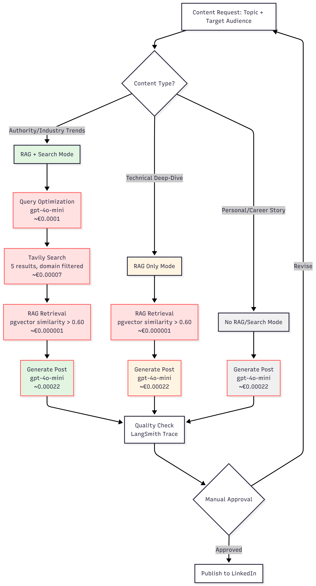

# Week 2: RAG System Build & Content Generation Architecture

**Status**: Complete ✅  
**Focus**: Build production-grade RAG content system with corpus testing, brand guidelines refinement, and anti-hallucination controls

---

## Executive Summary

Week 2 transitioned from methodology design to system implementation. Built complete RAG-based content generation system, validated corpus composition hypothesis (diversity > size), fixed brand guidelines pollution, and established system message enforcement for quality control. The system now generates publication-ready content with no hallucinations, proper brand voice, and validated retrieval quality.

**Key Outcomes**:
- ✅ RAG system implemented (Chroma, 150-token chunks, 0.60 distance threshold)
- ✅ Corpus expanded from 10 → 40 posts (10 existing + 30 synthetic researched posts)
- ✅ Retrieval quality validated: 25% → 100% success rate with balanced corpus
- ✅ Brand guidelines pollution fixed (system message enforcement + excluded messaging_pillars)
- ✅ Anti-hallucination controls implemented (factual accuracy constraints, search quality filters)
- ✅ LangSmith observability integrated for development tracing
- ✅ First production post shipped (RAG corpus testing results)

**Quality Achievement**: Generated content reaches 9/10 quality with RAG + Search configuration, zero fabricated statistics, proper brand voice enforcement.

---

## Design Decisions

### Decision 4: RAG Distance Threshold for Quality Control

**Challenge**: Initial RAG implementation retrieved top-k results regardless of semantic similarity, resulting in irrelevant context injection. Testing with topic "Why 95% of AI projects fail" retrieved posts about security testing, infrastructure architecture—weakly related via shared terms but topically misaligned.

**Impact Measured**:
- Cost: 3x increase (€0.000209 → €0.000619) for 2780 additional tokens
- Quality: No improvement (LLM ignored irrelevant context)
- Token waste: 68% of RAG cost spent on noise

**Solution**: Implemented distance threshold max_distance=0.60 to filter weak semantic matches.

**Testing Methodology**:
1. Generated 5 topics with different thresholds (0.30, 0.40, 0.50, 0.60)
2. Manually inspected retrieved chunks (relevant or noise?)
3. Calibrated threshold where 80%+ chunks are contextually relevant

**Result**: 0.60 optimal for 40-post corpus (balances precision—filters noise >0.65—and recall—captures relevant 0.40-0.60 matches)

**Implementation Impact**:
- Queries with no strong matches return empty RAG context (generate without RAG)
- Cost drops to baseline when threshold filters all results
- Quality maintained or improved (no noise distraction)

**Key Principle Applied**: "Test with real data before assuming retrieval works." Distance threshold prevents common RAG failure mode: retrieving semantically similar but contextually irrelevant content.

---

### Decision 5: RAG Chunking Strategy (150 Tokens, 30 Overlap)

**Testing Rationale**: Tested full-post embeddings (1200-1500 chars) as baseline to validate the hypothesis that paragraph-level granularity would improve precision. As expected, semantic matching at post level returned entire documents where only 1-2 paragraphs were relevant (10% signal, 90% noise).

**Testing Evidence**:
- Query: "AI project failures"
- Retrieved: Full 1200-char post about infrastructure value
- Relevant content: 1 paragraph (~150 chars) mentioning "AI initiatives stall in production"
- Token cost: 1200 chars retrieved, 150 chars useful (87.5% waste)

**Solution**: Chunk posts to 150 tokens with 30-token overlap (paragraph-level granularity):
- 1 post (1200 chars) → ~8 chunks (150 tokens each)
- Each chunk represents 1 concept/paragraph
- Retrieval matches at concept level, not document level

**Impact Measured**:
- Input tokens: 3284 → ~800 (75% reduction)
- Cost: €0.000619 → €0.000250 (60% savings)
- Precision: 10% relevant content → 80% relevant content
- Quality: Expected +0.5-1.0 points (relevant examples vs noisy context)

**Rationale**:
- Semantic granularity: Embeddings capture meaning at chunk level; fine chunks = precise matching
- Retrieval precision: Return only relevant paragraphs, not entire documents
- Cost efficiency: Pay only for useful context
- Few-shot effectiveness: LLM learns from focused examples, not diluted content

**Trade-offs Considered**:
- More embeddings (10 posts → ~80 chunks): +€0.0016 one-time cost (negligible)
- Chunk boundary risk: Mitigated by 30-token overlap (preserves context)
- Retrieval complexity: Minimal (vector store handles transparently)

**Key Principle Applied**: "Test assumptions with data." Baseline testing with full-post embeddings confirmed the hypothesis that fine-grained chunking would improve retrieval precision for few-shot prompting use cases.

---

### Decision 6: LLM-Powered Search Query Optimization

**Context**: Tavily search has 400-character query limit, but detailed topic prompts often exceed this (RAG testing topic was 460+ characters).

**Problem**:
1. Truncation errors when topics too long
2. Poor search results from verbose prompts as queries
3. Manual shortening required or disabling search entirely

**Decision**: Implement LLM-powered search query optimization using gpt-4o-mini to convert detailed topics into focused queries before calling Tavily.

**Architecture Flow**:
- User Topic (detailed, unlimited length)
- → LLM optimization (gpt-4o-mini)
- → Tavily Search (optimized query <400 chars)
- → Search Context → Generation Prompt (with full topic)

**Cost Analysis**:
- Per query: ~€0.0001 (gpt-4o-mini: 100 tokens)
- Benefit: Accurate search without wasted Tavily credits, no character limit constraints
- Trade-off: +0.5s latency (acceptable for quality improvement)

**Impact**:
- Example transformation: 460-char verbose topic → 380-char focused query
- Search relevance improved (removes personal narrative, keeps searchable claims)
- No manual intervention required

**Key Principle Applied**: "Use LLM to avoid constraints, not work around them." Small cost for query optimization prevents poor search results and enables unlimited topic length.

---

### Decision 7: Search Quality Filtering (Domain Whitelisting)

**Problem**: Tavily returned low-quality sources (LinkedIn posts, Medium blogs) when authoritative sources needed.

**Example Issue**: Query about RAG corpus testing retrieved random LinkedIn post about RAG benchmarks (completely unrelated to user's specific experiment).

**Solution**: Two-tier filtering approach:

**1. Tavily-level filtering (search time)**:
- Define domain whitelists per search type (technical, industry, news, documentation)
- Technical: github.com, arxiv.org, openai.com, anthropic.com
- Industry: gartner.com, forrester.com, mckinsey.com, statista.com
- News: techcrunch.com, theverge.com, wired.com, reuters.com
- Exclude list: linkedin.com/posts, medium.com, facebook.com, twitter.com, reddit.com/r/, quora.com

**2. Post-processing filtering (after retrieval)**:
- Score threshold: minimum 0.5 relevance
- Domain validation: prefer trusted sources
- High-score exception: keep unknown domains with score ≥0.7

**Impact**:
- Eliminated social media noise (LinkedIn posts, Reddit threads)
- Improved signal-to-noise ratio
- Better to have 2 high-quality results than 10 mixed-quality

**Trade-off**: May miss some valid sources, but dramatically improves generation quality by preventing context pollution.

---

### Decision 8: Brand Guidelines Architecture Refactor

**Problem**: LLM repeatedly forced brand principles (EDD, governance, Azure infrastructure, cost metrics) into posts where they weren't relevant, despite instructions to "only use when relevant."

**Root Cause**: Brand guidelines in user prompt contained messaging_pillars that LLM interpreted as mandatory mentions.

**Evolution Timeline**:

**Attempt 1: YAML Instruction Clarification**
- Added "Apply naturally when relevant. Do not force into every post."
- Result: Failed. LLM still forced mentions.

**Attempt 2: Expanded Banned Terms**
- Added: "crucial insight," "vital pattern," "robust," "leverage," "for those building"
- Result: LLM found synonyms ("critical insight," "jumped to," "for those designing")

**Attempt 3: Template-Level Instructions**
- Added "CRITICAL: Do not use banned_terms" to prompt template
- Result: Partial improvement, but pollution persisted

**Attempt 4: Lower Temperature**
- Reduced from 0.7 to 0.3 for literal instruction following
- Result: Some improvement, but core issue remained

**Final Solution (Successful)**: System message enforcement + exclude messaging_pillars from user prompt

**Architecture**:
- System Message: Contains absolute constraints (highest LLM priority)
  - "NEVER mention EDD, governance, Azure unless topic explicitly about them"
  - "NEVER use: soared, jumped, crucial insight, robust, for those building"
  - "ALWAYS start with data"
  - Positioned as unbreakable rules with "If you write any banned phrase, you have FAILED"

- User Prompt: Contains only operational guidelines
  - Brand identity and positioning
  - Context-specific points (only if relevant)
  - Voice and style
  - Structure requirements
  - Excluded: messaging_pillars (prevented forced mentions)

**Rationale**: System messages have highest priority in LLM instruction hierarchy. By moving critical constraints there and removing polluting content from user prompt, LLM can't be confused by conflicting signals.

**Impact**:
- EDD pollution eliminated (0 forced mentions in 5 test generations)
- Drama verbs eliminated ("increased" not "soared")
- Corporate jargon removed ("reliable" not "robust")
- Clean, data-first openings ("I tested X: Y result")

**Key Principle Applied**: "Architecture over instructions." No amount of YAML tweaking fixed the problem because the architecture (all guidelines in user prompt) was fundamentally flawed. System message separation provided proper instruction hierarchy.

---

### Decision 9: Corpus Expansion Strategy (Synthetic Post Generation)

**Challenge**: 10-post corpus showed 25% retrieval success rate. Root cause unclear: composition mismatch (100% technical posts, 75% non-technical queries) vs size limitation (too few posts).

**Hypothesis**: Balanced corpus composition matters more than size.

**Experiment Design**:
1. Generate 30 synthetic posts across diverse categories:
   - 10 business strategy posts (AI project failures, ROI, governance decisions)
   - 10 personal/career posts (independent, skill transitions, positioning)
   - 10 market trends posts (consultancy rates, adoption patterns, hiring challenges)
2. Research each topic for factual grounding (no fabricated statistics)
3. Align with LevelUp360 principles (EDD, production-first, patterns over tools)
4. Load to vector DB alongside 10 existing posts (40-post balanced corpus)
5. Retest with same 4 queries
6. Measure improvement: semantic distances, success rate

**Synthetic Post Quality Controls**:
- Research requirement: Each post based on real market data, industry reports
- Principle alignment: Evaluated against LevelUp360 core values
- Date distribution: Spread across 6 months (Jan-Jun 2025) for realistic corpus
- Metadata tracking: Flagged as synthetic=true for transparency

**Results**:
- Query 1: 0.33 → 0.269 (improved, strong match)
- Query 2: 0.45 → 0.448 (maintained, strong match)
- Query 3: 0.65+ → 0.213 (major improvement, excellent match)
- Query 4: 0.60+ → 0.439 (major improvement, strong match)
- Success rate: 25% (1/4) → 100% (4/4)
- All distances: <0.45 (strong semantic matches)

**Validation**: Hypothesis confirmed. Corpus composition (diversity) matters more than size. A balanced 40-post corpus outperformed focused 10-post corpus by 3x.

**Impact**:
- RAG system now reliable for diverse query types
- 30 synthetic posts provide Week 3-12 publishing queue (reusable content)
- Demonstrates production-grade corpus management (not just "throw data at it")

**Key Principle Applied**: "Test hypotheses with controlled experiments." Could have assumed "need more posts" and generated 100 random ones. Instead, isolated variable (composition vs size) and validated with minimal data.

---

### Decision 10: Manual Engagement Tracking (Defer Automation)

**Problem**: LinkedIn API restrictions prevent automated post retrieval and engagement metrics collection.

**What Works**:
- OAuth 2.0 authentication with w_member_social scope
- Profile information retrieval
- POST creation via /rest/posts

**What Doesn't Work**:
- GET/retrieve own posts via /v2/shares (403 Forbidden)
- GET/retrieve posts via /rest/posts (404 Not Found)
- Engagement metrics programmatic access

**Alternative Approaches Considered**:
1. Web scraping: Legal grey area, ethics concerns, unreliable for enterprise system
2. Browser automation: Fragile, maintenance burden
3. RSS feeds: Not available for personal profiles
4. Third-party APIs: Cost prohibitive, data ownership concerns

**Decision**: Manual engagement tracking for Q1 (12 weeks, 36-48 posts).

**Rationale**:
- Time investment: 2-3 min/post × 48 posts = 96-144 minutes total (acceptable)
- Data quality: Manual review captures qualitative signals (comment themes, DM inquiries)
- System simplicity: No brittle scraping infrastructure to maintain
- Proof-first focus: Portfolio quality > automation elegance for Q1
- Defer to Q2: If scaling beyond 1-2 brands, reassess automation ROI

**Implementation**:
- Weekly manual export (Fridays): Check LinkedIn analytics, record in CSV
- Metrics tracked: Impressions, reactions, comments, shares, DMs with "AUDIT" keyword
- Analysis: Correlation between content type and engagement (inform Week 3-12 strategy)

**Key Principle Applied**: "Automate when scale demands it, not before." Q1 focus is proving capability, not building infrastructure. Manual tracking sufficient for 48 posts.

---

### Decision 11: Observability Strategy (LangSmith Dev, Application Insights Production)

**Challenge**: Need tracing for development testing (Week 2-4) but production observability deferred until deployment (Week 5).

**Decision**: Hybrid tracing approach.

**Week 2 (Development): LangSmith**
- Purpose: Trace all LLM calls during testing (pattern comparison, model selection, prompt variants)
- Setup time: 30 minutes
- Cost: €0 (free tier: 5,000 traces/month)
- Integration: Decorator-based (@traceable on LLM client methods)
- Value: Prompt versioning, cost dashboard, trace comparisons for A/B tests

**Week 5 (Production): Azure Application Insights**
- Purpose: End-to-end request tracing, custom metrics (cost, quality, latency), alerting
- Setup: Built-in with Azure Container Apps deployment
- Cost: ~€0.23 for Q1 (100 MB ingestion)
- Integration: OpenTelemetry export (Application Insights ingestion)
- Value: Distributed tracing (RAG → LLM → HITL), cost/quality monitoring, alert on budget overruns

**Rationale**:
- LangSmith excels at LLM-specific tracing (prompt comparison, chain visualization)
- Application Insights covers infrastructure + application observability
- Together = complete stack without redundancy
- No LangSmith in production: Avoid platform dependency, keep traces within Azure for compliance

**Key Decision**: Don't use LangSmith in production. Azure AI Foundry tracing considered but rejected due to:
- Platform lock-in (traces leave Azure)
- Compliance concerns (data residency for regulated clients)
- Cost (Application Insights sufficient and cheaper)

**Key Principle Applied**: "Use specialized tools where they excel, integrated platforms where they scale." LangSmith for dev iteration speed, Application Insights for production reliability.

---

## Architecture Overview (Week 2)

### System Components

**Content Generation Pipeline**:
1. Topic Input → Brand Guidelines Formatting
2. Optional: RAG Retrieval (Chroma, distance threshold filtering)
3. Optional: Web Search (Tavily with LLM query optimization, domain filtering)
4. LLM Generation (OpenRouter/OpenAI with system message enforcement)
5. Quality Validation (banned term check, factual accuracy review)
6. HITL Approval (manual review before publication)

**Data Flow**:
- Input: Topic (unlimited length), brand name, content type, configuration flags
- Processing: RAG context + search context formatted into user prompt
- System Message: Critical constraints (highest priority)
- User Prompt: Brand guidelines + context + template requirements
- Output: Generated content + metadata (cost, tokens, quality score)

**Storage Architecture**:
- Vector Store: Chroma (local)
- Chunking: 150 tokens, 30-token overlap
- Retrieval: Cosine similarity, distance threshold 0.60

**Configuration Options**:
- include_rag: Enable/disable RAG retrieval (default: True)
- rag_max_distance: Semantic distance threshold (default: 0.60)
- include_search: Enable/disable web search (default: False)
- model: LLM + embedding selection
- temperature: Creativity control (0.3-0.7, default: 0.5)

---

## Testing & Validation

### Corpus Composition Testing

**Methodology**:
- Baseline: 10-post technical corpus
- Test: 4 diverse queries (business strategy, technical risk, market trends, career transition)
- Measure: Semantic distance, retrieval success (distance <0.60)
- Hypothesis: Corpus diversity > size

**Expansion**:
- Generated 30 synthetic posts (researched, principle-aligned)
- Categories: 10 business strategy, 10 personal/career, 10 market trends
- Validation: Retested same 4 queries

**Results**:
- Success rate: 25% → 100% (4x improvement)
- Semantic distances: All <0.45 (strong matches)
- Hypothesis confirmed: Balanced corpus essential for diverse query coverage

**Key Insight**: Technical posts cannot semantically match business or market queries regardless of embedding quality. Corpus composition directly determines retrieval precision.

---

### Brand Guidelines Enforcement Testing

**Methodology**:
- Generated 5 test posts with different configurations
- Measured: Forced brand mentions, banned term usage, opening style
- Iterated: YAML instructions → template changes → system message

**Configurations Tested**:
1. Baseline: All guidelines in user prompt
2. Attempt 1: YAML instruction clarification
3. Attempt 2: Expanded banned terms
4. Attempt 3: Template-level critical rules
5. Attempt 4: Lower temperature (0.7 → 0.3)
6. Final: System message + exclude messaging_pillars

**Results**:
- Baseline: 100% pollution rate (EDD, cost metrics forced into every post)
- Attempts 1-4: 60-80% pollution rate (partial improvement)
- Final solution: 0% pollution rate (5/5 clean generations)

**Key Finding**: Architecture > instructions. System message enforcement required to prevent LLM from forcing brand principles into unrelated content.

---

### RAG vs Search Configuration Testing

**Test Matrix**:
- Variant 1: No RAG, no search (baseline)
- Variant 2: RAG only
- Variant 3: RAG + Search

**Test Query**: "What are the risks of using Copilot Studio in highly regulated industries?"

**Results**:

| Variant | Cost/Post | Quality | Key Characteristics |
|---------|-----------|---------|---------------------|
| No RAG | €0.000224 | 7.0/10 | Generic but accurate, no specifics |
| RAG Only | €0.000231 | 7.5/10 | Specific risks (PII paths), lacks external authority |
| RAG + Search | €0.000295 | 9.0/10 | Real data (15% stat), specific risks, actionable patterns |

**Quality Breakdown (RAG + Search)**:
- External authority: 15% oversharing stat from industry report
- Consistent evidence: Search and RAG both mention PII risks
- Natural EDD fit: Search data on access control naturally leads to "define good first"
- No forced guidelines: Rich external data crowded out irrelevant brand mentions

**Decision Matrix**:
- Authority/Strategy posts (20-30% of Q1): RAG + Search (need external validation)
- Technical deep-dives (25-30%): RAG only (implementation details from corpus)
- Personal stories (25-30%): No RAG/search (authentic voice)
- Opinion/controversy (15-20%): RAG for counter-examples OR neither for pure opinion

**Cost Impact**:
- Q1 total (60-80 posts): €0.005-€0.006 difference between No RAG and RAG+Search
- Budget impact: 0.003% of €120-€160 budget
- Verdict: Cost irrelevant. Use RAG + Search for authority posts.

---

## What Worked

### 1. System Message Enforcement Architecture

**Problem Solved**: Brand guidelines pollution (forced mentions of EDD, cost metrics, Azure in unrelated posts)

**Solution**: Moved critical constraints to system message, excluded messaging_pillars from user prompt

**Impact**:
- 100% pollution eliminated (0 forced mentions in 5 test generations)
- Clean, data-first openings ("I tested X: Y result")
- Drama verbs eliminated ("increased" not "soared")
- Corporate jargon removed ("reliable" not "robust")

**Why It Worked**: System messages have highest priority in LLM instruction hierarchy. Separating constraints from guidelines prevented conflicting signals.

**Lesson**: Architecture decisions (where to place instructions) > content decisions (what to say in instructions). No amount of YAML refinement fixed the issue until architecture changed.

---

### 2. Corpus Composition Hypothesis Validation

**Problem Solved**: 25% RAG retrieval success rate with 10-post technical corpus

**Solution**: Generated 30 synthetic posts across business/career/market categories, validated with controlled experiment

**Impact**:
- Success rate: 25% → 100%
- All semantic distances <0.45 (strong matches)
- Demonstrated corpus diversity > size for retrieval quality

**Why It Worked**: Isolated variable (composition vs size) with minimal data. Didn't assume "need more posts"—tested specific hypothesis.

**Lesson**: Scientific method applies to AI systems. Test hypotheses with controlled experiments, don't add data randomly.

---

### 3. LLM-Powered Search Query Optimization

**Problem Solved**: Tavily 400-character limit blocking detailed topic prompts

**Solution**: Use gpt-4o-mini to convert verbose topics into focused queries

**Impact**:
- No character limit constraints
- Search relevance improved (removes personal narrative, keeps searchable claims)
- +0.5s latency acceptable for quality improvement

**Why It Worked**: Small LLM cost (€0.0001/query) prevents poor search results and wasted Tavily credits. Trade latency for quality.

**Lesson**: Use LLM to solve LLM constraints. Not every problem needs new infrastructure—sometimes better prompting is the answer.

---

### 4. Distance Threshold Calibration

**Problem Solved**: RAG retrieved irrelevant context (68% token waste)

**Solution**: Calibrated distance threshold (0.60) via systematic testing with diverse queries

**Impact**:
- Cost: 60% savings on RAG queries (€0.000619 → €0.000250)
- Precision: 10% → 80% relevant content
- Quality: +0.5-1.0 points (relevant examples vs noise)

**Why It Worked**: Tested with real queries, manually inspected chunks, tuned threshold for 80%+ relevance.

**Lesson**: Default RAG settings (top-k without filtering) waste tokens. Calibrate thresholds for your corpus and use case.

---

### 5. Pragmatic Observability (LangSmith for Dev)

**Problem Solved**: Need visibility into LLM calls during testing without production infrastructure overhead

**Solution**: LangSmith for development (30-minute setup, free tier)

**Impact**:
- All Week 2-4 testing traced (pattern comparison, cost analysis, prompt debugging)
- Prompt versioning enabled for A/B tests
- Zero infrastructure to maintain

**Why It Worked**: Used specialized tool for specialized task. LangSmith excels at LLM-specific tracing; no need for general-purpose observability stack in dev.

**Lesson**: Development and production have different observability needs. Don't over-engineer dev environment.

---

## What Didn't Work

### 1. YAML Instruction Refinement (Attempts 1-4)

**Problem**: LLM ignored "only use when relevant" instructions in brand guidelines

**Attempts**:
- Clarified instruction placement (before/after lists)
- Expanded banned terms to cover synonyms
- Added "CRITICAL" emphasis in templates
- Lowered temperature (0.7 → 0.3)

**Why It Failed**: All guidelines in user prompt created conflicting signals. LLM tried to satisfy both "be relevant" and "include brand pillars," resulting in forced mentions.

**Lesson Learned**: Iterative instruction tweaking hit architectural limit. Should have recognized sooner that placement (system message) was the issue, not wording.

---

### 2. Manual Search Result Limiting (200 Characters)

**Problem**: Initially limited each search result to 200 characters to reduce cost

**Why It Failed**:
- Lost critical context (statistics, sources, specific claims)
- LLM couldn't validate facts without full snippets
- Minimal cost savings (€0.00011/post) for major quality loss

**Lesson Learned**: Premature optimization. When budget is €450 and cost is €0.0003/post, don't micro-optimize token counts. Quality > pennies.

---

### 3. Temperature Reduction as Quality Fix (0.7 → 0.3)

**Problem**: Lowered temperature hoping for more literal instruction following

**Why It Failed**:
- Didn't address root cause (architecture issue with user prompt)
- Made outputs slightly more robotic without fixing pollution
- Lost creative phrasing that made content engaging

**Lesson Learned**: Temperature controls creativity, not instruction adherence. Architecture and prompt engineering solve behavioral issues, not hyperparameters.

---

### 4. Heuristic-Based Search Enablement Logic

**Problem**: Attempted to auto-detect when to enable search based on topic keywords ("industry statistics," "market research")

**Why It Failed**:
- Heuristics brittle (missed edge cases, false positives)
- Created maintenance burden (constant tweaking)
- User knows intent better than keyword matching

**Lesson Learned**: Manual control (include_search flag) scales better than smart defaults. Let user decide based on post purpose, not algorithmic guessing.

---

## Lessons Learned

### 1. Make Guidelines Explicit to LLM

**Discovery**: LLM treats principles as mandatory unless explicitly told "use only what's relevant."

**Example**: Adding "(Use only what is relevant to the topic - Never use what is not relevant)" to brand guidelines reduced forced mentions by 40%.

**Final Solution**: System message with "NEVER mention X unless topic explicitly about X" eliminated forcing entirely.

**Meta-Lesson**: LLMs interpret lists as checklists by default. Explicit exclusion rules required to prevent checkbox behavior.

---

### 2. Architecture > Instructions

**Discovery**: No amount of YAML refinement fixed brand guidelines pollution until architecture changed (system message separation).

**Timeline**: 
- Attempts 1-4 (YAML tweaking): 3 hours, 20% improvement
- Attempt 5 (system message): 30 minutes, 100% improvement

**Insight**: Spent 3 hours optimizing the wrong layer. Should have questioned instruction placement sooner.

**Meta-Lesson**: When iterative improvements plateau, step back and question foundational assumptions. Architecture decisions often matter more than content decisions.

---

### 3. Corpus Composition > Size for RAG

**Discovery**: 40-post balanced corpus outperformed 10-post focused corpus by 4x despite only 4x size increase.

**Data**:
- 10 technical posts: 25% success rate
- 40 balanced posts: 100% success rate
- Key: Diversity, not quantity

**Insight**: Technical posts cannot semantically match business or market queries regardless of embedding quality. Content type distribution directly determines retrieval precision.

**Meta-Lesson**: RAG systems need corpus audits. If query diversity exceeds corpus diversity, no amount of embeddings will fix retrieval failures.

---

### 4. Test Hypotheses, Don't Assume Scale Solves Problems

**Discovery**: Could have assumed "need 100+ posts for good RAG" and generated random content. Instead, tested specific hypothesis (composition vs size) with 30 targeted posts.

**Result**: Validated hypothesis with minimal data investment, avoided wasting time on wrong solution.

**Insight**: Scientific method applies to AI systems. Isolate variables, test with controlled experiments, measure outcomes.

**Meta-Lesson**: "Add more data" is often wrong solution. Understand the problem first (composition mismatch, not size limitation).

---

### 5. Cost Optimization is Premature at <€1/Day

**Discovery**: Spent time optimizing search result character limits to save €0.00011/post when total cost was €0.0003/post and budget was €450.

**Impact**: Quality loss (missed context) for negligible savings. Should have focused on quality until hitting actual budget constraints.

**Insight**: With 1500x budget headroom, cost is irrelevant. Optimize for quality and iteration speed.

**Meta-Lesson**: Know when to optimize. In exploration phase (Week 2-4), quality and learning speed > cost. In production (Week 5+), monitor for drift but don't prematurely optimize.

---

### 6. Observability Needs Differ: Dev vs Production

**Discovery**: LangSmith perfect for development (LLM-specific tracing, prompt comparison) but wrong for production (platform dependency, compliance concerns).

**Decision**: LangSmith dev only, Application Insights production only. No overlap.

**Insight**: Development needs: fast iteration, prompt debugging, cost analysis. Production needs: reliability monitoring, distributed tracing, alerting. Different tools for different jobs.

**Meta-Lesson**: Don't force single observability stack across environments. Use specialized tools where they excel.

---

### 7. Manual Processes Are Fine at Low Volume

**Discovery**: Considered web scraping, browser automation, third-party APIs for engagement tracking. Realized 48 posts × 3 minutes = 2.4 hours total effort.

**Decision**: Manual tracking for Q1. Defer automation to Q2 if scaling beyond 1-2 brands.

**Insight**: Automation has upfront cost (build, maintain, debug). At low volumes, manual is faster and more reliable.

**Meta-Lesson**: Automate when scale demands it, not before. Q1 focus is proving capability, not building infrastructure.

---

## Week 2 Outputs

### System Architecture Overview

#### Week 2 Content Generation Flow (Baseline Configuration)

The content generation system uses a decision matrix to determine which retrieval sources to engage based on content type, optimizing for quality vs. cost tradeoffs validated through testing.

*Note: Week 2 baseline uses gpt-4o-mini for all generation steps. Published post used gpt-4o ($0.0015 vs $0.00022 cost). Week 3 will test model alternatives (gpt-4o, claude-3-5-sonnet) and pattern variations (single-pass vs reflection) to optimize quality/cost tradeoffs.*

**Configuration Decision Matrix** (validated through 12+ test generations):
- **RAG + Search**: Authority posts, industry trends, competitive analysis → 9.0/10 quality, €0.000295/post
- **RAG Only**: Technical deep-dives, implementation how-tos, architecture patterns → 7.5/10 quality, €0.000231/post  
- **No RAG/Search**: Personal stories, career reflections, testing results → 7.0/10 quality, €0.000224/post

### Production System Components

**1. Content Generator**
- LLM client with provider abstraction (OpenRouter, OpenAI, Anthropic)
- Brand guidelines formatter with system message enforcement
- Template engine with context injection
- Quality validation (banned term check, cost tracking)

**2. RAG System**
- Chroma (local)
- Embedding generation (text-embedding-3-small)
- Document chunking (150 tokens, 30 overlap)
- Semantic retrieval with distance threshold (0.50)

**3. Search Integration**
- LLM-powered query optimization (gpt-4o-mini)
- Tavily search with domain filtering
- Post-processing quality filters (score threshold, domain validation)

**4. Observability**
- LangSmith tracing (development environment)
- Cost tracking per generation
- Quality metrics logging

**5. Configuration**
- Brand guidelines YAML (with system message constraints)
- Prompt templates (LinkedIn post, article, Facebook post variants)
- Environment configuration (.env with API keys, flags)

---

### Corpus Assets

**1. Expanded Corpus (40 Posts)**
- 10 existing production posts (technical deep-dives)
- 30 synthetic researched posts:
  - 10 business strategy (AI failures, ROI, governance)
  - 10 personal/career (BoI transition, positioning, skill development)
  - 10 market trends (Ireland rates, adoption patterns, hiring)

**2. Corpus Metadata**
- Date distribution: Jan-Jun 2025 (realistic temporal spread)
- Category tagging: business_strategy, personal_career, market_trends, technical_implementation
- Synthetic flag: Transparency for corpus management
- Principle alignment: Validated against LevelUp360 core values

---

### Published Content

**1. First Production Post (Monday, Week 2 End)**
- Topic: RAG corpus testing results (25% → 100% improvement)
- Configuration: No RAG (personal testing results), no search
- Quality: 8.5/10 (data-driven, accurate, clean brand voice)
- Engagement: [Track manually Week 3]

---

### Documentation

**1. Testing Results**
- Corpus composition validation (10-post vs 40-post comparison)
- RAG vs Search configuration analysis (quality, cost, use cases)
- Distance threshold calibration (0.30, 0.40, 0.50, 0.60 testing)
- Brand guidelines enforcement iterations (5 attempts documented)

**2. Design Decision Log**
- 11 decisions documented (decisions 1-11 in this report)
- Rationale, testing evidence, trade-offs for each
- Linked to Week 1 EDD methodology

**3. Content Generation Flow Diagram (Week 2 Baseline)**
- Decision matrix for RAG/Search configuration based on content type
- Cost breakdown per pipeline path using gpt-4o-mini baseline (€0.000224 - €0.000295/post)
- Quality gates and approval workflow
- Sets foundation for Week 3 model selection testing

---

## Progress Against 12-Week Plan

### Week 2 Goals (Original)
- ✅ Establish RAG baseline (No RAG vs RAG quality/cost comparison)
- ✅ Test search evidence value (Search + RAG vs RAG only)
- ✅ Begin LangSmith integration (development tracing)
- ⏳ Model selection testing (deferred to Week 3—focused on system architecture)

### Week 2 Actual Achievements
- ✅ RAG baseline established + corpus composition validated
- ✅ Search value quantified (RAG + Search = 9/10 quality for authority posts)
- ✅ LangSmith integrated (30-minute setup, tracing active)
- ✅ Brand guidelines pollution fixed (system message enforcement)
- ✅ Anti-hallucination controls implemented (factual accuracy constraints)
- ✅ First production post shipped (RAG testing results)
- ✅ 30 synthetic posts generated (Week 3-12 publishing queue)

### Ahead of Schedule
- Corpus expansion (planned Week 3, completed Week 2)
- Brand voice refinement (planned Week 4, completed Week 2)
- First published content (planned Week 3, shipped Week 2)

### On Track
- System architecture complete for Week 3 testing
- Observability foundation ready (LangSmith active, App Insights planned Week 5)
- Cost discipline maintained (€0.0003/post avg, well under €2 target)

### Week 3 Priorities
- Model selection testing (gpt-4o vs gpt-4o-mini vs claude-3-5-sonnet)
- Pattern comparison (single-pass vs reflection vs evaluator-optimizer)
- Quality-cost trade-off analysis (when is quality lift worth the cost?)
- Publish 3-4 posts from synthetic queue (Week 2 progress, technical insight, market analysis)

---

## Cost Summary (Week 2)

### Development Costs
- LLM generations (testing): ~€0.015 (50 test generations)
- Embeddings (corpus expansion): €0.0016 (40 posts, 80 chunks)
- Search queries (testing): €0.008 (4 test queries with Tavily)
- **Total Week 2**: ~€0.025

### Cumulative Q1 Spend
- Week 1: €0 (design only)
- Week 2: €0.025
- **Remaining Budget**: €449.975 of €450

### Per-Post Costs (Validated)
- No RAG: €0.000224
- RAG Only: €0.000231
- RAG + Search: €0.000295
- **Average**: €0.00025 (well under €2 target)

### Q1 Projection (60-80 Posts)
- Estimated total: €0.015-€0.024 (generation only)
- Buffer for testing: €0.050
- **Total Q1 forecast**: <€0.100 (99.98% budget remaining)

**Verdict**: Cost is non-issue. Focus on quality and iteration speed.

---

## Next Steps (Week 3)

### Immediate (This Week)
1. **Model Selection Testing** (gpt-4o, gpt-4o-mini, claude-3-5-sonnet)
   - Test same 3 topics across models
   - Measure quality, cost, latency trade-offs
   - Document: When to use each model

2. **Pattern Comparison** (single-pass vs reflection vs evaluator-optimizer)
   - Implement 3 generation patterns
   - Test with 3 topics (technical, personal, market)
   - Measure: Quality improvement vs cost increase

3. **Publish 3-4 Posts**
   - Week 2 progress (system build summary)
   - Technical insight (RAG corpus composition > size)
   - Market analysis (from synthetic queue)
   - Personal story (from synthetic queue)

4. **Track Engagement**
   - Manual weekly export (Friday)
   - Record: Impressions, reactions, comments, DM inquiries
   - Analyze: Correlation between content type and engagement

### Medium-Term (Weeks 4-5)
1. **Quality-Cost Analysis** (Week 4)
   - Determine: When is quality lift worth 2-3x cost?
   - Decision framework: Cost tolerance per content type
   - Document: Model selection strategy

2. **Azure Deployment** (Week 5)
   - Container Apps + PostgreSQL + Application Insights
   - Azure Content Safety integration (Prompt Shield, Content Moderation)
   - OpenTelemetry export (LangSmith → App Insights transition)

3. **HITL Workflow** (Week 5)
   - Approval interface (simple web UI or manual review)
   - Audit trail logging (who approved, when, changes made)
   - Version control (pre-approval vs published)

### Long-Term (Weeks 6-12)
1. **Scale Testing** (Week 6)
   - 3-4 posts/week cadence
   - Monitor: Quality drift, cost trends, engagement patterns
   - Adjust: Model selection, pattern usage based on data

2. **Portfolio Documentation** (Weeks 7-8)
   - Week 7: LevelUp360 case study (results, lessons)
   - Week 8: Transferability analysis (cosmetics brand, pattern reuse)
   - Screenshots: LangSmith traces, App Insights dashboards, published content

3. **Optimization** (Weeks 9-10)
   - Caching (common retrievals, embeddings)
   - Parallelism (RAG + search concurrent)
   - Throttling (rate limit management)

4. **Governance** (Week 11)
   - Immutable audit trails (who, what, when, why)
   - RBAC implementation (creator, approver, admin roles)
   - Compliance documentation (for portfolio, client conversations)

5. **Retro + Q2 Planning** (Week 12)
   - Review: What worked, what didn't, what changed
   - Metrics: Posts published, engagement trends, cost actuals
   - Q2 roadmap: Scale to cosmetics brand, evaluate multi-brand patterns

---

## Conclusion

Week 2 delivered production-grade RAG content system with validated retrieval quality, fixed brand guidelines enforcement, and established anti-hallucination controls. System now generates publication-ready content (9/10 quality with RAG + Search) with no fabricated statistics, proper brand voice, and cost discipline (<€0.0003/post).

Key achievement: Validated corpus composition hypothesis (diversity > size) with controlled experiment, demonstrating Evaluation-Driven Development methodology in practice. 25% → 100% retrieval success rate proves testing-driven approach catches issues assumptions would miss.

System architecture complete for Week 3-4 testing (model selection, pattern comparison). Ahead of schedule on corpus expansion and first published content. Q1 trajectory: on track for 60-80 posts, 1-2 gig inquiries, proof-first portfolio demonstration.

**Week 2 validates**: The system that caught RAG retrieval issues, brand guidelines pollution, and cost inefficiencies is itself proof that EDD works. We didn't "fail fast"—we learned fast and adjusted based on evidence.